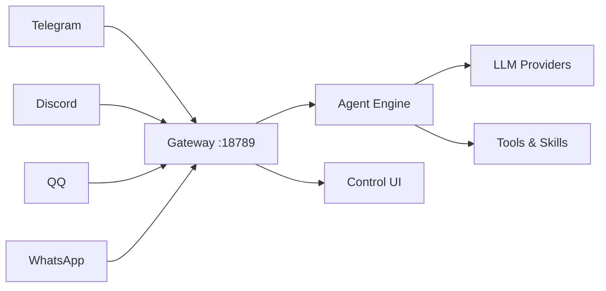

## 引言

OpenClaw 是由社区驱动的开源个人 AI 助手框架，在 GitHub 上拥有超过 37 万星标。它的核心理念是：**你自己的 AI 助手，运行在你自己的设备上，通过你日常使用的聊天渠道与你交流**。基于 Node.js/TypeScript 构建，OpenClaw 以 Gateway 作为控制平面，统一管理会话、频道、工具和事件，支持 WhatsApp、Telegram、Slack、Discord、Google Chat、Signal、iMessage、Microsoft Teams、飞书、微信、**QQ** 等 20+ 消息平台。

本文将详细介绍如何在 WSL2 环境中从零部署 OpenClaw，涵盖环境准备、安装配置、频道接入、服务自启、以及生产环境的优化建议。

> 推荐使用 WSL2 而非原生 Windows。OpenClaw 官方文档明确指出：**WSL2 更加稳定且推荐用于完整体验**。

---

## 1. 什么是 OpenClaw

OpenClaw 本质上是一个运行在本地的 Gateway 服务，连接你选择的大语言模型（Anthropic Claude、OpenAI、Google Gemini 等）与多个消息平台。它将 LLM 的能力带到你已经使用的聊天工具里，而不是让你去适应一个新的应用界面。

其核心架构包括：

- **Gateway（网关）**：核心控制平面，负责会话管理、消息路由、工具执行、定时任务调度。默认监听 `127.0.0.1:18789`
- **Agent 引擎**：处理对话上下文、工具调用、模型交互。支持多 Agent 路由
- **Channel Adapters（频道适配器）**：为每个消息平台实现收发适配，统一消息处理
- **技能系统（Skills）**：用户可安装和管理的 Agent 技能扩展
- **Control UI**：基于 Web 的管理面板，用于配置和即时聊天



---

## 2. WSL2 环境准备

### 2.1 安装 WSL2

确保你已安装 WSL2 并设置为默认版本。在 Windows PowerShell（管理员）中：

```powershell
# 启用 WSL 功能
wsl --install

# 确认版本为 WSL2
wsl --version

# 如尚未升级到 WSL2
wsl --set-default-version 2
```

安装 Linux 发行版（推荐 Ubuntu 24.04）：

```powershell
wsl --install -d Ubuntu-24.04
```

### 2.2 进入 WSL 并更新系统

```bash
# 进入 WSL2 终端后
sudo apt update && sudo apt upgrade -y

# 安装基础工具
sudo apt install -y curl wget git build-essential
```

### 2.3 安装 Node.js

OpenClaw 要求 Node.js 24（推荐）或 Node.js 22.16+。我们通过 NodeSource 安装：

```bash
# 安装 Node.js 24（推荐）
curl -fsSL https://deb.nodesource.com/setup_24.x | sudo -E bash -
sudo apt install -y nodejs

# 验证版本
node --version    # 应输出 v24.x.x
npm --version     # 应输出 10.x.x 或更高
```

如果使用 nvm 管理多版本 Node.js：

```bash
curl -o- https://raw.githubusercontent.com/nvm-sh/nvm/v0.40.1/install.sh | bash
source ~/.bashrc
nvm install 24
nvm use 24
```

---

## 3. 安装 OpenClaw

### 3.1 一键安装（推荐）

```bash
# 全局安装 OpenClaw
npm install -g openclaw@latest

# 或使用 pnpm
pnpm add -g openclaw@latest
```

### 3.2 运行引导向导

```bash
# 交互式引导，同时安装守护进程（systemd 用户服务）
openclaw onboard --install-daemon
```

引导过程将引导你完成：

1. **选择模型提供商**：Anthropic、OpenAI、Google Gemini、自定义兼容端点等
2. **配置 API 密钥**：输入你的模型 API Key
3. **选择默认模型**：例如 `anthropic/claude-sonnet-4-6`
4. **配置工作区**：默认 `~/.openclaw/workspace`
5. **配置 Gateway**：端口（默认 18789）、认证令牌、Tailscale 暴露选项
6. **配置频道**：Telegram、WhatsApp、QQ、Discord 等
7. **安装守护进程**：自动配置为 systemd 用户服务，实现开机自启
8. **健康检查**：启动 Gateway 并验证运行状态

### 3.3 从源码安装（开发模式）

```bash
git clone https://github.com/openclaw/openclaw.git
cd openclaw

# 安装 pnpm（如果未安装）
npm install -g pnpm

pnpm install

# 首次运行配置
pnpm openclaw setup

# 构建 Control UI
pnpm ui:build

# 开发模式启动（自动热重载）
pnpm gateway:watch
```

---

## 4. 配置文件详解

OpenClaw 使用 JSON5 格式的配置文件，位于 `~/.openclaw/openclaw.json`。JSON5 支持注释和尾随逗号，编写体验比纯 JSON 好得多。

### 4.1 最小配置

```json5
// ~/.openclaw/openclaw.json
{
  agent: {
    model: "anthropic/claude-sonnet-4-6",
  },
}
```

### 4.2 完整配置示例

```json5
{
  // Gateway 网络配置
  gateway: {
    port: 18789,
    bind: "127.0.0.1",       // 仅监听本地回环
    auth: {
      mode: "token",         // token | password | none
    },
  },

  // Agent 默认配置
  agents: {
    defaults: {
      workspace: "~/.openclaw/workspace",
      model: {
        primary: "anthropic/claude-sonnet-4-6",
        fallbacks: ["openai/gpt-5.4"],     // 故障转移模型
      },
      // 工具配置文件
      tools: {
        profile: "coding",   // coding | assistant | minimal
      },
      // 非 main 会话的沙箱模式
      sandbox: {
        mode: "non-main",    // 非 main 会话在 Docker 沙箱中运行
      },
    },
  },

  // QQ 频道配置
  channels: {
    qqbot: {
      enabled: true,
      appId: "YOUR_QQ_APP_ID",
      clientSecret: "YOUR_QQ_APP_SECRET",
      // DM 策略：pairing（配对码）| allowlist | open | disabled
      dmPolicy: "pairing",
    },

    // Telegram 频道
    telegram: {
      enabled: true,
      botToken: "123456789:ABCdefGHIjklmnoPQRstuvWXyz",
      dmPolicy: "allowlist",
      allowFrom: ["@your_telegram_username"],
    },

    // Discord 频道
    discord: {
      enabled: true,
      token: "YOUR_DISCORD_BOT_TOKEN",
      dmPolicy: "pairing",
    },
  },

  // 消息显示配置
  messages: {
    groupChat: {
      visibleReplies: "message_tool",  // 群聊中使用消息工具回复
    },
  },

  // 定时任务（Cron）
  cron: {
    jobs: [
      {
        schedule: "0 9 * * *",         // 每天上午 9 点
        prompt: "给我今天的日程摘要",
        delivery: { channel: "telegram" },
      },
    ],
  },
}
```

### 4.3 QQ Bot 配置详解

要接入 QQ 频道，首先安装 QQ Bot 插件：

```bash
openclaw plugins install @openclaw/qqbot
```

然后在 [QQ 开放平台](https://q.qq.com/) 创建机器人应用，获取 AppID 和 AppSecret。

QQ Bot 支持：

- **C2C 私聊**：用户与机器人一对一私聊
- **群聊 @消息**：群内 @机器人触发对话
- **频道消息**：QQ 频道（Guild）中的频道消息
- **富媒体**：图片、语音、视频、文件

```json5
// QQ Bot 多账号配置
{
  channels: {
    qqbot: {
      enabled: true,
      appId: "111111111",
      clientSecret: "secret-of-bot-1",
      dmPolicy: "allowlist",
      groupPolicy: "open",
      accounts: {
        bot2: {
          enabled: true,
          appId: "222222222",
          clientSecret: "secret-of-bot-2",
        },
      },
    },
  },
}
```

**环境变量方式**（不写入配置文件）：

```bash
export QQBOT_APP_ID="your_app_id"
export QQBOT_CLIENT_SECRET="your_app_secret"
```

---

## 5. Systemd 服务配置（开机自启）

OpenClaw 的 `onboard --install-daemon` 或 `gateway install` 命令会自动创建 systemd 用户服务。

### 5.1 使用内置命令管理

```bash
# 安装用户级服务
openclaw gateway install

# 启动
openclaw gateway start

# 查看状态
openclaw gateway status

# 停止
openclaw gateway stop

# 重启
openclaw gateway restart

# 查看日志
journalctl --user -u openclaw-gateway -f
```

### 5.2 开机自动启动用户服务

WSL2 默认不会在 Windows 启动时自动运行，需要配置：

**方案一：启用 systemd 用户 lingering**

```bash
# 允许用户服务在未登录时继续运行
sudo loginctl enable-linger $USER

# 如果安装了系统级服务
sudo openclaw gateway install --system
sudo openclaw gateway start --system
```

**方案二：创建 Windows 启动任务**

在 Windows 中创建计划任务或使用 `wsl.conf` 配置自动启动：

```ini
# /etc/wsl.conf
[boot]
systemd=true
command="service cron start"
```

然后在 Windows PowerShell 中创建开机启动 WSL 的任务：

```powershell
$trigger = New-ScheduledTaskTrigger -AtStartup
$action = New-ScheduledTaskAction -Execute "wsl.exe" -Argument "-d Ubuntu-24.04 -u $env:UserName openclaw gateway status"
Register-ScheduledTask -TaskName "WSL-OpenClaw-Check" -Trigger $trigger -Action $action
```

### 5.3 手动创建 systemd 服务文件

如果需要更精细的控制：

```ini
# ~/.config/systemd/user/openclaw-gateway.service
[Unit]
Description=OpenClaw Gateway Service
After=network.target

[Service]
Type=simple
ExecStart=%h/.nvm/versions/node/v24.0.0/bin/openclaw gateway run
Restart=on-failure
RestartSec=10
Environment="PATH=%h/.nvm/versions/node/v24.0.0/bin:/usr/local/bin:/usr/bin:/bin"
Environment="NODE_ENV=production"

[Install]
WantedBy=default.target
```

启用服务：

```bash
systemctl --user daemon-reload
systemctl --user enable openclaw-gateway.service
systemctl --user start openclaw-gateway.service
```

---

## 6. 常用管理与操作命令

### 6.1 基本操作

```bash
# 检查安装健康状态
openclaw doctor

# 在同一聊天中切换模型
openclaw agent --message "解释这段代码" --thinking high

# 向指定频道发送消息
openclaw message send --target +1234567890 --message "Hello from OpenClaw"

# 打开管理面板
openclaw dashboard
```

### 6.2 配置管理

```bash
# 交互式配置向导
openclaw configure

# 读写单个配置项
openclaw config get agents.defaults.workspace
openclaw config set agents.defaults.heartbeat.every "2h"
openclaw config unset plugins.entries.brave.config.webSearch.apiKey

# 验证配置
openclaw config schema

# 自动修复配置问题
openclaw doctor --fix
```

### 6.3 添加频道

```bash
# 交互式添加频道
openclaw channels add

# 直接添加 QQ Bot（通过 token）
openclaw channels add --channel qqbot --token "AppID:AppSecret"

# 通过文件添加密钥
openclaw channels add --channel qqbot --token-file /path/to/secret.txt
```

### 6.4 会话管理

在聊天中可用的斜杠命令：

| 命令 | 说明 |
|------|------|
| `/new` 或 `/reset` | 开始新对话 |
| `/model [provider:model]` | 查看或切换模型 |
| `/think <level>` | 设置思考深度 |
| `/status` | 查看会话状态 |
| `/compact` | 压缩对话上下文 |
| `/usage` | 查看 Token 用量 |
| `/stop` | 停止当前任务 |
| `/retry` | 重试上次回答 |

---

## 7. WSL 特定问题与排查

### 7.1 网络问题

WSL2 使用虚拟网络适配器，与 Windows 主机不在同一子网。常见问题：

**问题 1：从 Windows 主机无法访问 Gateway**

WSL2 的 IP 地址会变化。解决方案：

```bash
# 方案一：使用 localhost 端口转发（WSL2 默认自动转发）
# Gateway 监听 127.0.0.1:18789 时，Windows 主机可直接访问

# 方案二：使用 Windows 端口转发获取 WSL IP
$wsl_ip = (wsl hostname -I).Trim()
netsh interface portproxy add v4tov4 listenport=18789 listenaddress=0.0.0.0 connectport=18789 connectaddress=$wsl_ip
```

**问题 2：WSL2 重启后 IP 变化**

```bash
# 获取当前 WSL IP
hostname -I | awk '{print $1}'

# 写入配置文件动态绑定
# 在 ~/.openclaw/openclaw.json 中
{
  gateway: {
    bind: "0.0.0.0",  // 注意安全：仅在可信网络使用
  },
}
```

### 7.2 端口转发

如果需要从外部访问 WSL2 中的 OpenClaw Gateway：

**方法一：netsh 端口转发（推荐）**

在 Windows PowerShell（管理员）中：

```powershell
# 添加端口转发规则
$wsl_ip = (wsl -d Ubuntu-24.04 hostname -I).Trim().Split()[0]
netsh interface portproxy add v4tov4 listenport=18789 listenaddress=0.0.0.0 connectport=18789 connectaddress=$wsl_ip

# 允许 Windows 防火墙
New-NetFirewallRule -DisplayName "OpenClaw Gateway" -Direction Inbound -LocalPort 18789 -Protocol TCP -Action Allow
```

**方法二：SSH 隧道**

```bash
# 从外部机器通过 SSH 隧道访问
ssh -L 18789:localhost:18789 user@windows-host-ip
```

### 7.3 文件路径

WSL2 中访问 Windows 文件系统时注意性能：

```bash
# 推荐：配置文件放在 Linux 文件系统中
# 正确路径：~/.openclaw/（/home/user/.openclaw/）

# 避免：放在 /mnt/c/ 下（跨文件系统性能差）
# /mnt/c/Users/xxx/.openclaw/  ← 不推荐

# 如果工作区需要访问 Windows 文件
# 使用符号链接
ln -s /mnt/c/Users/xxx/Projects ~/.openclaw/workspace/projects
```

### 7.4 内存与性能

```bash
# 限制 WSL2 内存使用（创建 %USERPROFILE%\.wslconfig）
# 在 Windows 中：
# [wsl2]
# memory=4GB
# processors=2

# 在 WSL 中监控资源
htop
free -h
```

### 7.5 常见错误排查

```bash
# 1. Gateway 无法启动
openclaw doctor                      # 诊断问题
journalctl --user -u openclaw-gateway -n 50  # 查看日志

# 2. 配置文件验证失败
openclaw config schema               # 查看完整 Schema
openclaw doctor --fix                # 自动修复

# 3. QQ Bot 连接失败
# 检查：AppID/AppSecret 是否正确
# 检查：Bot 是否启用了正确的 Intents（C2C 消息、群 @消息、频道消息）
# 检查：沙箱模式下 Bot 只能接收沙箱测试频道的消息

# 4. 插件问题
openclaw plugins list --json         # 查看已安装插件
openclaw plugins install @openclaw/qqbot  # 重新安装
```

---

## 8. 生产环境建议

### 8.1 安全加固

```json5
// 严格的安全配置
{
  gateway: {
    bind: "127.0.0.1",        // 仅本地回环
    auth: {
      mode: "token",           // 必须令牌认证
      // token 通过环境变量注入，不写入配置文件
    },
  },
  channels: {
    qqbot: {
      dmPolicy: "allowlist",   // 仅允许列表中的用户
      groupPolicy: "allowlist",
      // 敏感凭证使用文件引用
      clientSecretFile: "/secure/qqbot-secret.txt",
    },
  },
  agents: {
    defaults: {
      sandbox: {
        mode: "non-main",      // 非主会话启用沙箱
      },
    },
  },
}
```

### 8.2 日志与监控

```bash
# 配置日志轮转
# /etc/logrotate.d/openclaw
~/.openclaw/logs/*.log {
    daily
    rotate 7
    compress
    missingok
    notifempty
}

# 使用 openclaw health 检查
openclaw health --json
```

### 8.3 Docker 部署（可选）

对于需要容器化或隔离的生产场景：

```bash
# 从源码构建镜像
./scripts/docker/setup.sh

# 或使用预构建镜像
export OPENCLAW_IMAGE="ghcr.io/openclaw/openclaw:latest"
./scripts/docker/setup.sh

# 启动后查看状态
docker compose ps
docker compose logs -f
```

### 8.4 备份策略

```bash
# 重要文件备份
tar -czf openclaw-backup-$(date +%Y%m%d).tar.gz \
  ~/.openclaw/openclaw.json \
  ~/.openclaw/.env \
  ~/.openclaw/workspace/

# 定期备份（cron）
# 0 2 * * * tar -czf ~/backups/openclaw-$(date +\%Y\%m\%d).tar.gz ~/.openclaw/
```

### 8.5 模型选择建议

| 使用场景 | 推荐模型 | 说明 |
|---------|---------|------|
| 日常对话 | `anthropic/claude-sonnet-4-6` | 性价比与效果平衡最佳 |
| 复杂编程 | `anthropic/claude-opus-4-6` | 最强的推理和代码能力 |
| 低成本 | `openai/gpt-4o-mini` | 轻量级任务足够 |
| 中文优化 | `deepseek/deepseek-chat` | 中文理解更出色 |
| 本地推理 | `ollama/llama3.3` | 数据隐私、完全离线 |

---

## 9. 总结

OpenClaw 是一个成熟、功能全面的个人 AI 助手框架。在 WSL2 中部署它，你可以获得 Linux 环境的稳定性，同时享受 Windows 桌面生态的便利。通过合理的配置和频道接入，你的 AI 助手可以无缝融入你现有的沟通工具链——无论是在 QQ 群中回答问题，在 Telegram 中执行命令，还是在 Discord 中协助编程。

关键要点回顾：

1. **WSL2 是 Windows 上运行 OpenClaw 的推荐方案**，比原生 Windows 更稳定
2. **Node.js 24** 是推荐运行时版本
3. **`openclaw onboard --install-daemon`** 一条命令完成安装、配置和服务注册
4. **JSON5 配置文件** 支持注释和尾随逗号，易于维护
5. **QQ Bot 需要先安装插件** `@openclaw/qqbot`，然后在 QQ 开放平台创建应用
6. **systemd 用户服务 + loginctl enable-linger** 实现可靠的开机自启
7. **生产环境务必配置 DM 策略和沙箱**，保障安全性

官方文档：[docs.openclaw.ai](https://docs.openclaw.ai) · GitHub：[openclaw/openclaw](https://github.com/openclaw/openclaw)
